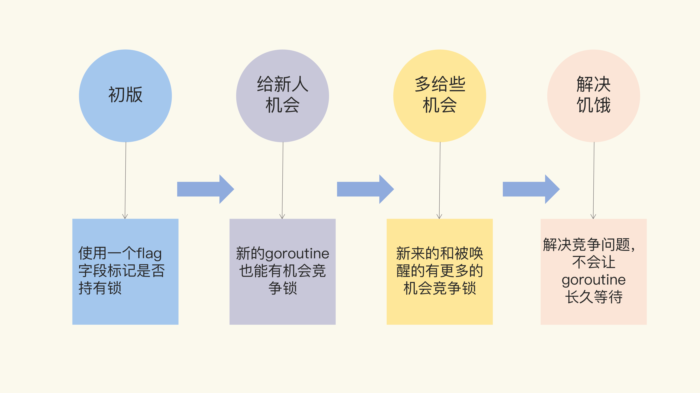
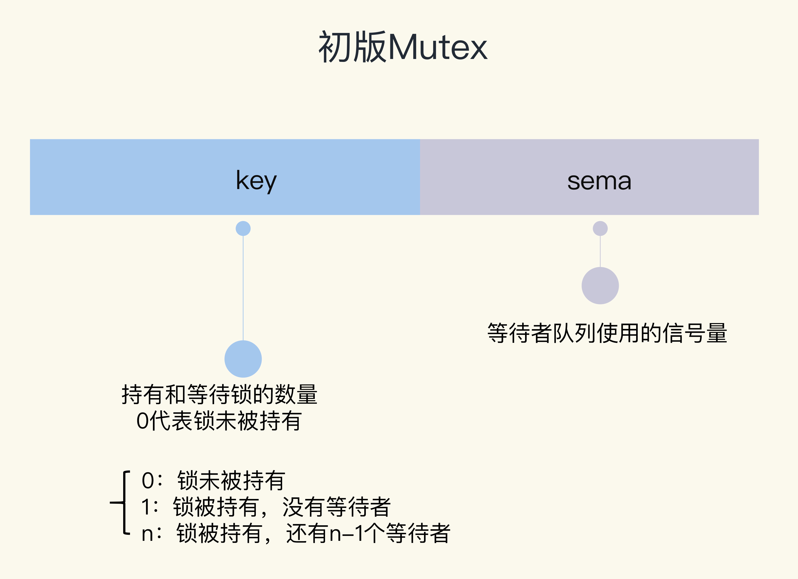
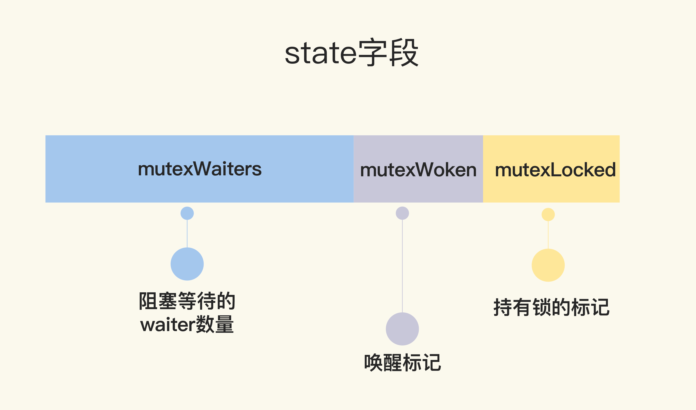
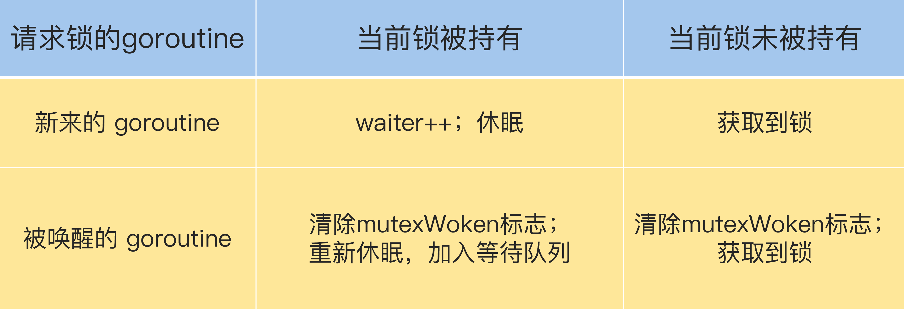

# Mutex

## 同步原语的使用场景

- 共享资源。并发地读写共享资源，会出现数据竞争（data race）的问题，所以需要 Mutex、RWMutex 这样的并发原语来保护。
- 任务编排。需要 goroutine 按照一定的规律执行，而 goroutine 之间有相互等待或者依赖的顺序关系，我们常常使用 WaitGroup 或者 Channel 来实现。
- 消息传递。信息交流以及不同的 goroutine 之间的线程安全的数据交流，常常使用 Channel 来实现。

## Mutex的使用


golang中锁都实现了Locker这个interface

```go
type Locker interface {
	Lock()
	Unlock()
}
```

在一个场景，10个goroutine每个goroutine都增加一个变量10万次的场景，如果不用锁，这个变量结果是多少？

```go
func main() {
	var count = 0
	// 使用WaitGroup等待10个goroutine完成
	var wg sync.WaitGroup
	wg.Add(10)
	for i := 0; i < 10; i++ {
		go func() {
			defer wg.Done()
			// 对变量count执行10次加1
			for j := 0; j < 100000; j++ {
				count++
			}
		}()
	}
	// 等待10个goroutine完成
	wg.Wait()
	fmt.Println(count)
}

结果 
C:\gostudy\src\test\ttt>go run main.go
457446

C:\gostudy\src\test\ttt>go run main.go
369040

C:\gostudy\src\test\ttt>go run main.go
379494
```

为什么结果不是1 000 000呢，而是小于1000 000的值呢？

原因：因为count++并不是原子操作

count++的汇编结果为

```basic

 // count++操作的汇编代码
    MOVQ    "".count(SB), AX
    LEAQ    1(AX), CX
    MOVQ    CX, "".count(SB)
```

同一时刻，可能有多个线程，同时取出count这一变量，并对其加一，再设置回去，这样会导致很多一最后被“吞掉”了。


加上互斥锁后再运行。

```go
package main

import (
	"fmt"
	"sync"
)

func main() {
	// 互斥锁保护计数器
	var mu sync.Mutex
	// 计数器的值
	var count = 0

	// 辅助变量，用来确认所有的goroutine都完成
	var wg sync.WaitGroup
	wg.Add(10)

	// 启动10个gourontine
	for i := 0; i < 10; i++ {
		go func() {
			defer wg.Done()
			// 累加10万次
			for j := 0; j < 100000; j++ {
				mu.Lock()
				count++
				mu.Unlock()
			}
		}()
	}
	wg.Wait()
	fmt.Println(count)
}

结果：
C:\gostudy\src\test\ttt>go run main.go
1000000

C:\gostudy\src\test\ttt>go run main.go
1000000

C:\gostudy\src\test\ttt>go run main.go
1000000
```


实现一个带锁的计数器，计数器的结构体包含一个锁和计数变量

```go

func main() {
    var counter Counter
    var wg sync.WaitGroup
    wg.Add(10)
    for i := 0; i < 10; i++ {
        go func() {
            defer wg.Done()
            for j := 0; j < 100000; j++ {
                counter.Lock()
                counter.Count++
                counter.Unlock()
            }
        }()
    }
    wg.Wait()
    fmt.Println(counter.Count)
}


type Counter struct {
    sync.Mutex
    Count uint64
}
```

当然，也可以实现方法将锁完全封装起来

```go

func main() {
    // 封装好的计数器
    var counter Counter

    var wg sync.WaitGroup
    wg.Add(10)

    // 启动10个goroutine
    for i := 0; i < 10; i++ {
        go func() {
            defer wg.Done()
            // 执行10万次累加
            for j := 0; j < 100000; j++ {
                counter.Incr() // 受到锁保护的方法
            }
        }()
    }
    wg.Wait()
    fmt.Println(counter.Count())
}

// 线程安全的计数器类型
type Counter struct {
    CounterType int
    Name        string

    mu    sync.Mutex
    count uint64
}

// 加1的方法，内部使用互斥锁保护
func (c *Counter) Incr() {
    c.mu.Lock()
    c.count++
    c.mu.Unlock()
}

// 得到计数器的值，也需要锁保护
func (c *Counter) Count() uint64 {
    c.mu.Lock()
    defer c.mu.Unlock()
    return c.count
}
```

## 互斥锁的发展历程以及源码



### 第一代代码



```go

   // CAS操作，当时还没有抽象出atomic包
    func cas(val *int32, old, new int32) bool
    func semacquire(*int32)
    func semrelease(*int32)
    // 互斥锁的结构，包含两个字段
    type Mutex struct {
        key  int32 // 锁是否被持有的标识
        sema int32 // 信号量专用，用以阻塞/唤醒goroutine
    }
    
    // 保证成功在val上增加delta的值
    func xadd(val *int32, delta int32) (new int32) {
        for {
            v := *val
            if cas(val, v, v+delta) {
                return v + delta
            }
        }
        panic("unreached")
    }
    
    // 请求锁
    func (m *Mutex) Lock() {
        if xadd(&m.key, 1) == 1 { //标识加1，如果等于1，成功获取到锁
            return
        }
        semacquire(&m.sema) // 否则阻塞等待
    }
    
    func (m *Mutex) Unlock() {
        if xadd(&m.key, -1) == 0 { // 将标识减去1，如果等于0，则没有其它等待者
            return
        }
        semrelease(&m.sema) // 唤醒其它阻塞的goroutine
    }    
```


这里我们发现锁的实现比较简单，第一代的锁确实是这么实现的，看起来很公平。

**但是，但是从性能上来看，却不是最优的。因为如果我们能够把锁交给正在占用 CPU 时间片的 goroutine 的话，那就不需要做上下文的切换，在高并发的情况下，可能会有更好的性能。**

### 第二代代码（给新人机会）

锁的结构体

```go

   type Mutex struct {
        state int32
        sema  uint32
    }


    const (
        mutexLocked = 1 << iota // mutex is locked
        mutexWoken
        mutexWaiterShift = iota
    )
```



加锁源码

```go
   func (m *Mutex) Lock() {
        // Fast path: 幸运case，能够直接获取到锁
        if atomic.CompareAndSwapInt32(&m.state, 0, mutexLocked) {
            return
        }

        awoke := false
        for {
            old := m.state
            new := old | mutexLocked // 新状态加锁
            if old&mutexLocked != 0 {
                new = old + 1<<mutexWaiterShift //等待者数量加一
            }
            if awoke {
                // goroutine是被唤醒的，
                // 新状态清除唤醒标志
                new &^= mutexWoken
            }
            if atomic.CompareAndSwapInt32(&m.state, old, new) {//设置新状态
                if old&mutexLocked == 0 { // 锁原状态未加锁
                    break
                }
                runtime.Semacquire(&m.sema) // 请求信号量
                awoke = true
            }
        }
    }
```



释放锁源码

```go
   func (m *Mutex) Unlock() {
        // Fast path: drop lock bit.
        new := atomic.AddInt32(&m.state, -mutexLocked) //去掉锁标志
        if (new+mutexLocked)&mutexLocked == 0 { //本来就没有加锁
            panic("sync: unlock of unlocked mutex")
        }
    
        old := new
        for {
            if old>>mutexWaiterShift == 0 || old&(mutexLocked|mutexWoken) != 0 { // 没有等待者，或者有唤醒的waiter，或者锁原来已加锁
                return
            }
            new = (old - 1<<mutexWaiterShift) | mutexWoken // 新状态，准备唤醒goroutine，并设置唤醒标志
            if atomic.CompareAndSwapInt32(&m.state, old, new) {
                runtime.Semrelease(&m.sema)
                return
            }
            old = m.state
        }
    }
// 第一种情况，如果没有其它的 waiter，说明对这个锁的竞争的 goroutine 只有一个，那就可以直接返回了；如果这个时候有唤醒的 goroutine，或者是又被别人加了锁，那么，无需我们操劳，其它 goroutine 自己干得都很好，当前的这个 goroutine 就可以放心返回了。
// 第二种情况，如果有等待者，并且没有唤醒的 waiter，那就需要唤醒一个等待的 waiter。在唤醒之前，需要将 waiter 数量减 1，并且将 mutexWoken 标志设置上，这样，Unlock 就可以返回了。
```

mutexWoken的作用：

作者回复: 标记是否有“通过unlock唤醒”的waiter在竞争锁


释放锁和加锁的源码要结合在一起看，才能慢慢理解。

新来的锁有机会和之前休眠被唤醒的锁一起竞争锁。


###  第三代代码（多给新人些机会）

在lock的代码中，如果进程是新来的，会让其自旋一段时间，多给新人一些机会。

```go
   func (m *Mutex) Lock() {
        // Fast path: 幸运之路，正好获取到锁
        if atomic.CompareAndSwapInt32(&m.state, 0, mutexLocked) {
            return
        }

        awoke := false
        iter := 0
        for { // 不管是新来的请求锁的goroutine, 还是被唤醒的goroutine，都不断尝试请求锁
            old := m.state // 先保存当前锁的状态
            new := old | mutexLocked // 新状态设置加锁标志
            if old&mutexLocked != 0 { // 锁还没被释放
                if runtime_canSpin(iter) { // 还可以自旋
                    // 最后一个条件语句相当于阻止持有锁的goroutine唤醒休眠的routine,
                    // 相当于多给新人些机会。
                    if !awoke && old&mutexWoken == 0 && old>>mutexWaiterShift != 0 &&
                        atomic.CompareAndSwapInt32(&m.state, old, old|mutexWoken) {
                        awoke = true
                    }
                    runtime_doSpin()
                    iter++
                    continue // 自旋，再次尝试请求锁
                }
                new = old + 1<<mutexWaiterShift
            }
            if awoke { // 唤醒状态
                if new&mutexWoken == 0 {
                    panic("sync: inconsistent mutex state")
                }
                new &^= mutexWoken // 新状态清除唤醒标记
            }
            if atomic.CompareAndSwapInt32(&m.state, old, new) {
                if old&mutexLocked == 0 { // 旧状态锁已释放，新状态成功持有了锁，直接返回
                    break
                }
                runtime_Semacquire(&m.sema) // 阻塞等待
                awoke = true // 被唤醒
                iter = 0
            }
        }
    }
```

### 第四代代码（解决饥饿模式）

但是你有没有想过，因为新来的 goroutine 也参与竞争，有可能每次都会被新来的 goroutine 抢到获取锁的机会，在极端情况下，等待中的 goroutine 可能会一直获取不到锁，这就是饥饿问题。


当然，你也可以暂时略过这一段，以后慢慢品，只需要记住，Mutex 绝不容忍一个 goroutine 被落下，永远没有机会获取锁。不抛弃不放弃是它的宗旨，而且它也尽可能地让等待较长的 goroutine 更有机会获取到锁。

比较难理解，可以以后慢慢体会。


lock源码

```go
   type Mutex struct {
        state int32
        sema  uint32
    }
    
    const (
        mutexLocked = 1 << iota // mutex is locked
        mutexWoken
        mutexStarving // 从state字段中分出一个饥饿标记
        mutexWaiterShift = iota
    
        starvationThresholdNs = 1e6
    )
    
    func (m *Mutex) Lock() {
        // Fast path: 幸运之路，一下就获取到了锁
        if atomic.CompareAndSwapInt32(&m.state, 0, mutexLocked) {
            return
        }
        // Slow path：缓慢之路，尝试自旋竞争或饥饿状态下饥饿goroutine竞争
        m.lockSlow()
    }
    
    func (m *Mutex) lockSlow() {
        var waitStartTime int64
        starving := false // 此goroutine的饥饿标记
        awoke := false // 唤醒标记
        iter := 0 // 自旋次数
        old := m.state // 当前的锁的状态
        for {
            // 锁是非饥饿状态，锁还没被释放，尝试自旋
            if old&(mutexLocked|mutexStarving) == mutexLocked && runtime_canSpin(iter) {
                if !awoke && old&mutexWoken == 0 && old>>mutexWaiterShift != 0 &&
                    atomic.CompareAndSwapInt32(&m.state, old, old|mutexWoken) {
                    awoke = true
                }
                runtime_doSpin()
                iter++
                old = m.state // 再次获取锁的状态，之后会检查是否锁被释放了
                continue
            }
            new := old
            if old&mutexStarving == 0 {
                new |= mutexLocked // 非饥饿状态，加锁
            }
            if old&(mutexLocked|mutexStarving) != 0 {
                new += 1 << mutexWaiterShift // waiter数量加1
            }
            if starving && old&mutexLocked != 0 {
                new |= mutexStarving // 设置饥饿状态
            }
            if awoke {
                if new&mutexWoken == 0 {
                    throw("sync: inconsistent mutex state")
                }
                new &^= mutexWoken // 新状态清除唤醒标记
            }
            // 成功设置新状态
            if atomic.CompareAndSwapInt32(&m.state, old, new) {
                // 原来锁的状态已释放，并且不是饥饿状态，正常请求到了锁，返回
                if old&(mutexLocked|mutexStarving) == 0 {
                    break // locked the mutex with CAS
                }
                // 处理饥饿状态

                // 如果以前就在队列里面，加入到队列头
                queueLifo := waitStartTime != 0
                if waitStartTime == 0 {
                    waitStartTime = runtime_nanotime()
                }
                // 阻塞等待
                runtime_SemacquireMutex(&m.sema, queueLifo, 1)
                // 唤醒之后检查锁是否应该处于饥饿状态
                starving = starving || runtime_nanotime()-waitStartTime > starvationThresholdNs
                old = m.state
                // 如果锁已经处于饥饿状态，直接抢到锁，返回
                if old&mutexStarving != 0 {
                    if old&(mutexLocked|mutexWoken) != 0 || old>>mutexWaiterShift == 0 {
                        throw("sync: inconsistent mutex state")
                    }
                    // 有点绕，加锁并且将waiter数减1
                    delta := int32(mutexLocked - 1<<mutexWaiterShift)
                    if !starving || old>>mutexWaiterShift == 1 {
                        delta -= mutexStarving // 最后一个waiter或者已经不饥饿了，清除饥饿标记
                    }
                    atomic.AddInt32(&m.state, delta)
                    break
                }
                awoke = true
                iter = 0
            } else {
                old = m.state
            }
        }
    }
    
    func (m *Mutex) Unlock() {
        // Fast path: drop lock bit.
        new := atomic.AddInt32(&m.state, -mutexLocked)
        if new != 0 {
            m.unlockSlow(new)
        }
    }
    
    func (m *Mutex) unlockSlow(new int32) {
        if (new+mutexLocked)&mutexLocked == 0 {
            throw("sync: unlock of unlocked mutex")
        }
        if new&mutexStarving == 0 {
            old := new
            for {
                if old>>mutexWaiterShift == 0 || old&(mutexLocked|mutexWoken|mutexStarving) != 0 {
                    return
                }
                new = (old - 1<<mutexWaiterShift) | mutexWoken
                if atomic.CompareAndSwapInt32(&m.state, old, new) {
                    runtime_Semrelease(&m.sema, false, 1)
                    return
                }
                old = m.state
            }
        } else {
            runtime_Semrelease(&m.sema, true, 1)
        }
    }
```

